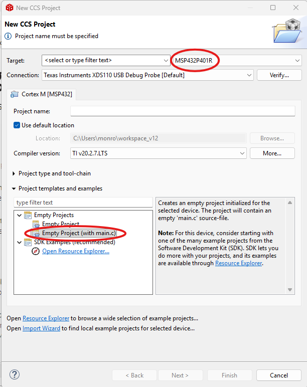
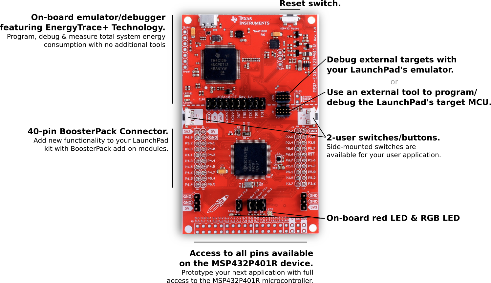
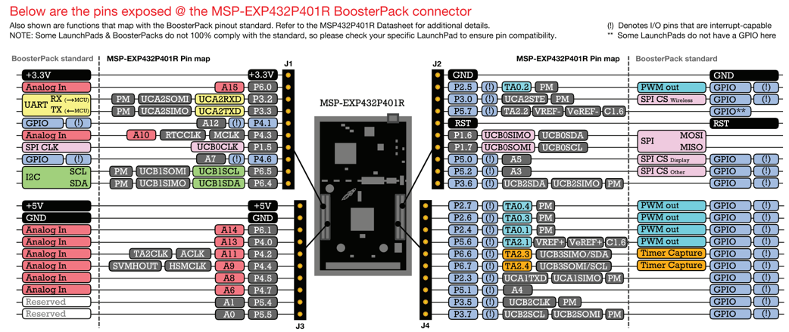

# Getting Started with the MSP432P401R

This folder explains the basic setup needed before running the examples in this repository.

---

## 1. Install Code Composer Studio

This repository was developed using:

**Code Composer Studio:** 12.8.1  
**Board:** MSP432P401R LaunchPad

Download Code Composer Studio (CCS):

https://www.ti.com/tool/download/CCSTUDIO/12.8.1

For Windows, download:

**Windows single file (offline) installer for Code Composer Studio IDE (all features, devices)**

After downloading the `.zip` file:

1. Extract the folder.
2. Open the extracted folder.
3. Run `ccs_setup_12.8.1.00005`.
4. Follow the installation steps.

---

## 2. Create a New CCS Project

1. Launch Code Composer Studio.
2. Select your workspace.
3. Navigate to **File → New → CCS Project**.
4. Select **MSP432P401R** as the target device.
5. Enter your project name.
6. Select **Empty Project (with main.c)**.
7. Click **Finish**.

The following screenshot highlights the project settings used throughout this repository.

---

## 3. Basic MSP432P401R Notes

The following images show the MSP432P401R LaunchPad and the pinout available through the BoosterPack headers.

These are useful references that you may find yourself coming back to throughout this repository.

### MSP432P401R LaunchPad Overview

Before working through the examples, keep the following in mind:

- The MSP432P401R is a 32-bit ARM Cortex-M4F microcontroller.
- Most examples in this repository use direct register-level programming.
- The watchdog timer is enabled after every reset and is disabled at the beginning of most examples.
- The onboard red LED is connected to **P1.0**.
- The onboard RGB LED is connected to **P2.0**, **P2.1**, and **P2.2**.
- The onboard push buttons are connected to **P1.1** and **P1.4**.

### MSP432P401R Pinout

The pinout above shows the GPIO pins and their alternate peripheral functions available on the MSP432P401R LaunchPad.

As you work through the examples in this repository, you can refer back to this diagram whenever you need to identify a pin or verify its available functions.

---

## 4. main.c Template

A starter `main.c` template is included in this folder.

Use it as a starting point when creating new MSP432P401R projects or organizing your own code.