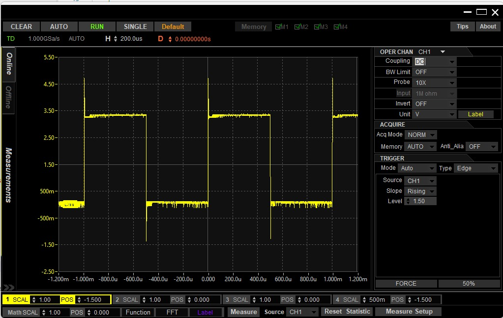

# Timer_A Frequency Generator 🦔

## 1. Overview

This example uses **Timer_A0** to generate an approximately **1 kHz square wave** on **P2.4 (TA0.1)**.

Unlike the previous Timer_A examples, the CPU does not poll a timer flag or execute an interrupt service routine to change the output. Instead, Timer_A controls the output pin directly through its hardware output functionality.

The timer is configured so that:

- **SMCLK** provides the timer clock.
- SMCLK is divided by **4**.
- **CCR0** defines the period of the waveform.
- **CCR1** defines the compare point within the period.
- **TA0.1** uses reset/set output mode.
- **P2.4** is connected to the TA0.1 peripheral output.

With the default SMCLK of approximately 3 MHz, the resulting signal is approximately:

- **Frequency:** 1 kHz
- **Period:** 1 ms
- **Duty cycle:** 50%
- **Output voltage:** approximately 0 V to 3.3 V

### Oscilloscope Output

The waveform below was measured directly from **P2.4** using an oscilloscope.



The rising edges occur approximately 1 ms apart, confirming an output frequency of approximately 1 kHz. The signal remains HIGH and LOW for approximately equal amounts of time, producing approximately a 50% duty cycle.

---

## 2. Hardware Used

- MSP432P401R LaunchPad
- Oscilloscope or logic analyzer
- Oscilloscope probe or jumper wires

---

## 3. Pinout / Wiring

| Signal | MSP432 Pin | Connection |
|---|---|---|
| Timer_A0.1 Output | P2.4 | Oscilloscope probe |
| Ground | GND | Oscilloscope ground |

Connect the oscilloscope probe tip to **P2.4** and the probe ground to a **GND** pin on the LaunchPad.

P2.4 is configured for its alternate **TA0.1** peripheral function rather than being controlled as a normal GPIO output.

---

## 4. Code Walkthrough

### 4.1 Timer_A Hardware Output

Timer_A can control certain MSP432 output pins directly through its capture/compare channels.

In this example:

```c
TIMER_A0
    |
    +-- CCR0 -> Defines the timer period
    |
    +-- CCR1 -> Defines the compare point
                    |
                    v
                  TA0.1
                    |
                    v
                   P2.4
```

Once Timer_A0 is configured and started, the peripheral generates the waveform without requiring the CPU to repeatedly modify the output pin.

This differs from manually toggling a GPIO inside a loop or interrupt service routine.

---

### 4.2 Configuring P2.4 for TA0.1

P2.4 can operate as a normal GPIO pin or as a peripheral pin for **Timer_A0.1**.

```c
P2->DIR  |= BIT4;
P2->SEL0 |= BIT4;
P2->SEL1 &= ~BIT4;
```

`DIR` configures P2.4 as an output, while `SEL0` and `SEL1` select the TA0.1 peripheral function.

For this pin:

```text
DIR  = 1
SEL1 = 0
SEL0 = 1
```

selects the Timer_A0.1 output function.

After the peripheral function is selected, Timer_A controls the output state instead of software writing directly to `P2->OUT`.

---

### 4.3 Timer Clock and Divider

The example assumes the default SMCLK is approximately:

```text
SMCLK ≈ 3 MHz
```

Timer_A0 uses SMCLK with a divide-by-4 clock divider:

```c
TIMER_A_CTL_SSEL__SMCLK
TIMER_A_CTL_ID__4
```

Therefore:

```text
3,000,000 Hz / 4 = 750,000 Hz
```

Timer_A0 receives approximately **750,000 timer ticks per second**.

The duration of one timer tick is therefore:

```text
1 / 750,000 ≈ 1.33 us
```

For a 1 kHz waveform:

```text
Frequency = 1,000 Hz

Period = 1 / Frequency
       = 1 / 1,000
       = 0.001 seconds
       = 1 ms
```

The required number of timer counts is:

```text
Timer Counts = Timer Frequency x Desired Period

             = 750,000 x 0.001

             = 750 counts
```

This is why the program defines:

```c
#define TIMER_A_PERIOD_COUNTS (750U)
```

---

### 4.4 CCR0 Defines the Period

Timer_A0 operates in **up mode**.

```c
TIMER_A0->CCR[0] = TIMER_A_PERIOD_COUNTS - 1U;
```

With:

```c
#define TIMER_A_PERIOD_COUNTS (750U)
```

CCR0 becomes:

```text
CCR0 = 750 - 1
     = 749
```

The timer counts through 750 count states before beginning the next period.

At approximately 750 kHz:

```text
750 counts / 750,000 counts per second
= 0.001 seconds
= 1 ms
```

Therefore:

```text
Frequency = 1 / 0.001
          = 1,000 Hz
          = 1 kHz
```

CCR0 can therefore be thought of as defining **how long one complete waveform period lasts**.

---

### 4.5 CCR1 Defines the Compare Point

CCR1 creates a compare event inside the period established by CCR0.

```c
TIMER_A0->CCR[1] = TIMER_A_HALF_PERIOD_COUNTS;
```

The example uses:

```c
#define TIMER_A_HALF_PERIOD_COUNTS (375U)
```

Since the complete period contains approximately 750 timer counts:

```text
750 / 2 = 375
```

CCR1 therefore places the compare event approximately halfway through the timer period.

Conceptually:

```text
Timer Count

0                    375                    749
|---------------------|----------------------|
                      ^
                     CCR1
                                             ^
                                            CCR0
```

CCR0 establishes the complete period, while CCR1 establishes a point within that period where the TA0.1 output can change state.

Placing CCR1 approximately halfway through the period produces approximately a **50% duty cycle** when used with reset/set output mode.

---

### 4.6 Reset/Set Output Mode

The TA0.1 capture/compare channel is configured using:

```c
TIMER_A0->CCTL[1] = TIMER_A_CCTLN_OUTMOD_7;
```

`OUTMOD_7` selects **reset/set** output mode.

For TA0.1:

- When the timer reaches **CCR1**, the output is reset LOW.
- When the timer reaches **CCR0**, the output is set HIGH.

Conceptually:

```text
                 CCR1                 CCR0
                   |                    |
                   v                    v

HIGH  -------------+                    +-------------
                   |                    |
LOW                +--------------------+
```

Because CCR1 occurs approximately halfway through the period, the output spends approximately half of each period HIGH and half LOW.

This produces the approximately 50% duty-cycle square wave observed on P2.4.

#### Why Reset/Set Instead of Toggle/Set?

Timer_A provides several hardware output modes.

For example, toggle/set would toggle the current output state when CCR1 is reached and set the output when CCR0 is reached.

Reset/set instead gives each event a defined output action:

```text
CCR1 -> RESET output LOW
CCR0 -> SET output HIGH
```

This makes the waveform behavior straightforward: CCR1 determines where the signal goes LOW, while CCR0 marks the period boundary and sets the signal HIGH again.

---

### 4.7 Hardware Generation vs. Software Toggling

A 1 kHz square wave has a period of:

```text
1 ms
```

For a 50% duty cycle, the output changes state every:

```text
0.5 ms
```

A software-based implementation could generate the signal by toggling a GPIO every 0.5 ms.

That would require the CPU to repeatedly execute code for every output transition.

This example instead connects the Timer_A peripheral directly to P2.4 through TA0.1.

After initialization:

```c
while (1)
{
    /* Timer_A0 generates the output signal in hardware. */
}
```

The CPU does not need to toggle the output, poll a timer flag, or service an interrupt.

Timer_A continues counting and controlling TA0.1 independently.

The progression from the previous examples is therefore:

```text
Timer_A Delay
    |
    +-- CPU polls the timer flag

Timer_A Interrupt
    |
    +-- Timer_A interrupts the CPU

Timer_A Frequency Generator
    |
    +-- Timer_A controls the output hardware directly
```

---

## 5. Expected Result

After programming the MSP432P401R:

1. Timer_A0 begins counting using SMCLK divided by 4.
2. CCR0 creates an approximately 1 ms timer period.
3. CCR1 creates a compare event approximately halfway through the period.
4. Reset/set output mode controls TA0.1 automatically.
5. P2.4 outputs an approximately 1 kHz square wave.

An oscilloscope connected to P2.4 should measure approximately:

| Measurement | Expected Value |
|---|---:|
| Frequency | 1 kHz |
| Period | 1 ms |
| HIGH time | 0.5 ms |
| LOW time | 0.5 ms |
| Duty cycle | 50% |
| LOW voltage | 0 V |
| HIGH voltage | 3.3 V |

Small differences from these values may occur because this example uses the approximate default SMCLK frequency rather than explicitly configuring a precision clock source.

---

## 6. Register Summary

| Register | Purpose |
|---|---|
| `P2->DIR` | Configures P2.4 as an output |
| `P2->SEL0` | Selects the P2.4 peripheral function |
| `P2->SEL1` | Selects the P2.4 peripheral function |
| `TIMER_A0->CTL` | Selects the timer clock, divider, and operating mode |
| `TIMER_A0->CCR[0]` | Defines the Timer_A0 period in up mode |
| `TIMER_A0->CCR[1]` | Defines the TA0.1 compare point |
| `TIMER_A0->CCTL[1]` | Configures the TA0.1 hardware output behavior |

---

## 7. Common Problems

### No waveform appears on P2.4

Verify that P2.4 is configured as an output and that its TA0.1 peripheral function is selected:

```c
P2->DIR  |= BIT4;
P2->SEL0 |= BIT4;
P2->SEL1 &= ~BIT4;
```

Selecting the peripheral function alone is not sufficient for the TA0.1 output. P2.4 must also be configured as an output using `DIR`.

### The waveform frequency is incorrect

Verify the assumed SMCLK frequency and Timer_A divider.

This example assumes:

```text
SMCLK ≈ 3 MHz
Divider = 4
Timer clock ≈ 750 kHz
```

Changing the system clock or Timer_A divider changes the output frequency.

### The oscilloscope shows a flat line

Verify:

- The probe tip is connected to P2.4.
- The probe ground is connected to LaunchPad GND.
- P2.4 is configured for TA0.1 output.
- The program was successfully flashed.
- The oscilloscope voltage and time scales are appropriate.

For a 1 kHz signal, a horizontal scale near **200 us/div** makes the waveform easy to observe.

### The waveform appears unstable on the oscilloscope

Configure the oscilloscope to trigger on the P2.4 signal.

For a 0 V to 3.3 V square wave, a rising-edge trigger around the middle of the voltage range provides a stable display.

---

## 8. Next Example

The next example builds on Timer_A concepts by creating a simple **stopwatch**.

Instead of generating a continuous hardware waveform, Timer_A will provide a time base that software can use to track elapsed time.
